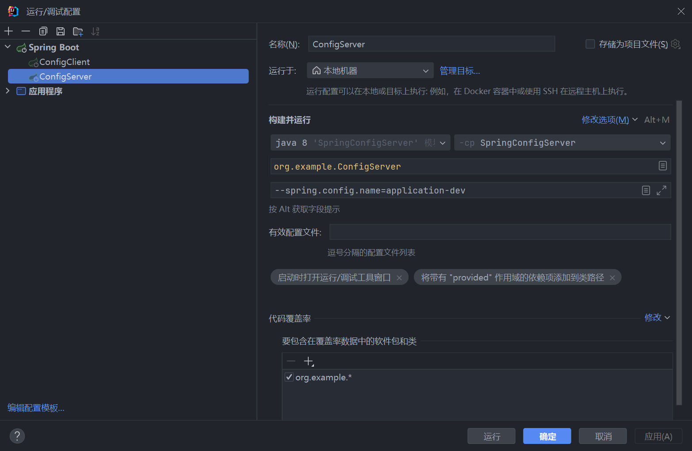

## Spiring Cloud config 实例
### 1. 使用方式
请在启动配置上添加程序实参（非虚拟机参数）,两处服务都需要配置
```agsl
--spring.config.name=application-dev 
```


### 2. 启动oracle 
```shell
docker run --restart always -d -p 8080:8080 -p 1521:1521 --name orac truevoly/oracle-12c

```
参考 https://www.jianshu.com/p/fb00d47ba3d9
### 3. 启动顺序 先configserver 后 configclient

### 4. 参考
> https://www.cnblogs.com/liukaifeng/p/10052583.html

> https://docs.spring.io/spring-cloud-config/reference/server/environment-repository/jdbc-backend.html